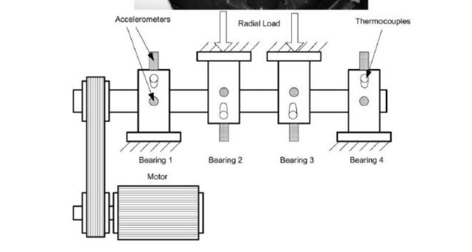

# Information about the datasets used in this project
Due to the number of files and its combined weight, it has been chosen not to
upload the whole dataset to this repo. The whole dataset is available in this 
[link](https://ti.arc.nasa.gov/tech/dash/groups/pcoe/prognostic-data-repository/#bearing)
## General info of the dataset  
The dataset is composed of three different data packets that are divided into many files which
contains exactly 20 480 points recorded every 1 second at a sampling rate of 20kHz.
The next table shows the general features of each set.  
|Set number   |Start Date   |End Date   |No. of files   | No. of Bearing   |No. of channels   | Recording Interval  | Format  | Description  |
|---|---|---|---|---|---|---|---|---|
| 1  | 22/10/2003  | 25/11/2003  | 2156  | 4  | 8  | Every 10 min exceot first 43 (5min)  | ASCII  |  Test to failure experiment, inner race defect ocurred in bearing 3 and roller element defect in bearing 4 |
| 2  | 12/02/2004  | 19/02/2003  | 984  | 4  | 4  | 10 min   | ASCII  | Test to failure, outer race failure occured in bearing 1  |
| 3 | 4/03/2004 |4/04/2004 |4448 |4 |4 |10 min |ASCII | Test to failure, outer race failure ocurred in bearing 3 |

The setup is installed as shown on the next image.

